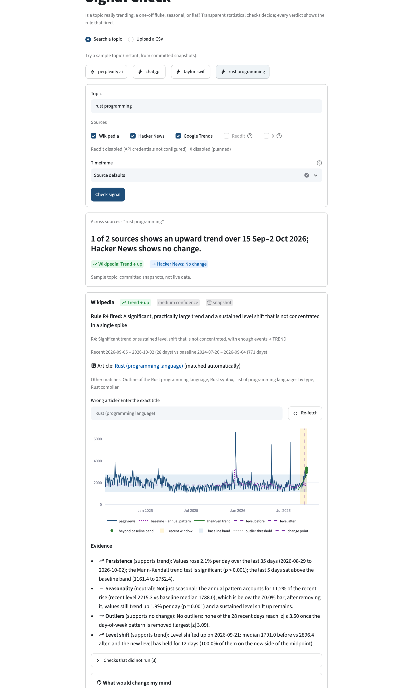

# Signal Check

**Is this change real and lasting, or is it noise?**

**Live demo: <https://pragmatic-philosopher09.github.io/signal-check/>** — a static site that runs
the same Python engine in your browser ([what it can and can't do](#static-demo-github-pages)).

Signal Check is a free, non-commercial web app. It gives a deterministic, evidence-backed verdict
on public attention data from Wikipedia, Hacker News, Google Trends, Reddit and, optionally, X.
The verdict is one of `TREND` (up or down), `FLUKE`, `SEASONAL`, `NO_CHANGE` or `INCONCLUSIVE`.

Each source gets a card showing:
- the verdict and its confidence
- the decision rule that fired
- evidence tied to marks on an annotated chart
- computed "what would change my mind" conditions
- source-specific caveats

A top card compares directions across sources over a shared calendar window.



### What makes it different

1. **Deterministic statistics decide the verdict.** An optional LLM only narrates findings that
   have already been validated. It never decides.
2. **Breadth and low-count awareness.** A spike driven by one origin, or a jump from 2 to 8
   mentions, is flagged instead of being called a trend.
3. **Cross-source corroboration.** Directions are compared across sources over the same dates,
   never raw values.
4. **Computed "what would change my mind" conditions.** For example: the level that would have to
   hold, or for how long.
5. **Measured quality.** There is a published eval with a held-out test split, real-world cases
   labelled before the engine saw them, and an explicit false-TREND rate on pure noise.

The full build specification is in [`COPILOT_BRIEF.md`](COPILOT_BRIEF.md).

## Quickstart

Requires Python 3.12.

```bash
python3.12 -m venv .venv && source .venv/bin/activate
pip install -r requirements.txt        # app only; use requirements-dev.txt for tests/linters
cp .env.example .env                   # optional: keys for Reddit, X, LLM narration
streamlit run app.py
```

Click a sample topic chip to see instant results from committed snapshots, without network
access. You can also type a topic and click **Check signal**, or upload a CSV: either date +
value, or a Google Trends export.

## Architecture

```mermaid
flowchart LR
    subgraph Adapters["signalcheck/adapters"]
        W[Wikipedia] & H[Hacker News] & G["Google Trends<br/>snapshot / CSV"] & R[Reddit] & X[X] & C[CSV upload]
    end
    Adapters -->|"Series<br/>(aggregates only, 6h cache)"| P["preprocess<br/>regularise, gaps, partial period,<br/>windows, robust baseline"]
    P --> K["7 checks<br/>persistence, concentration, seasonality,<br/>outliers, level shift, low count, breadth"]
    K --> V["verdict R1–R6<br/>+ confidence<br/>+ change-my-mind"]
    V --> XS["cross-source<br/>shared calendar window"]
    V --> N["narration<br/>(optional LLM, validated;<br/>template fallback)"]
    XS --> UI["Streamlit UI<br/>app.py + signalcheck/ui"]
    N --> UI
    XS --> EX["signalcheck/web/export<br/>JSON contract"]
    N --> EX
    EX --> WEB
    CRON["refresh.yml (daily cron)<br/>scripts.refresh_data"] -->|"adapters → aggregate snapshots<br/>data/samples + manifest.json"| EX
    subgraph Browser["GitHub Pages (static)"]
        WEB["React app<br/>web/"] <-->|postMessage| WK["Web Worker<br/>Pyodide + signalcheck"]
        WK -->|"XHR, 6h IndexedDB cache"| API["Wikipedia / HN APIs"]
    end
```



The same package powers both frontends. The Streamlit app imports it directly. The static site
gets precomputed sample results (JSON written by the engine at build time from snapshots that a
daily GitHub Actions job refreshes) and, for live queries
and CSV uploads, runs the unchanged package inside [Pyodide](https://pyodide.org) in a Web Worker.

The engine never knows which source a series came from. Each adapter turns its source into a
`Series` ([`models.py`](signalcheck/models.py)).

[`analyse`](signalcheck/engine/pipeline.py) runs these steps and never raises for a short series:
preprocess → checks → decision table → confidence → change-my-mind. A series that is too short
returns `INCONCLUSIVE` via R1.

## Methodology

Every threshold lives in [`config.yaml`](config.yaml). [`signalcheck/config.py`](signalcheck/config.py)
validates it at load time. The UI's **Methodology** expander is generated from the live config.

**Preprocessing**
- The recent window is `clamp(round(0.2·n), …)`: D 7–28, W 4–13, M 3–6. The baseline is
  everything before it.
- Baseline statistics are robust: the median and the scaled MAD.
- Counts and pageviews are analysed on a `log1p` scale.
- Gaps are recorded, never silently interpolated. Short gaps are filled (and flagged) only for
  the checks that need a regular series.
- A partial last period is dropped and drawn greyed on the chart.

**Checks** (in [`signalcheck/engine/checks/`](signalcheck/engine/checks)):

| Check | Statistical question |
| --- | --- |
| [Persistence](signalcheck/engine/checks/persistence.py) | Is there a monotonic trend over the recent window plus some baseline context? Uses the Hamed–Rao Mann–Kendall test and a Theil–Sen slope as % of baseline per period. It must be significant **and** practically large (`min_slope`). A significant but negligible slope (`negligible_slope`) counts as "no change". |
| [Concentration](signalcheck/engine/checks/concentration.py) | What share of the recent excess over the baseline median comes from the top 1 and top 2 periods? A high share means a one-off. |
| [Seasonality](signalcheck/engine/checks/seasonality.py) | With ≥ 2 years of data, how much of the rise does the annual STL component explain? Is anything left in the rise's direction after removing it? Day-of-week patterns are removed as a nuisance only. |
| [Outliers](signalcheck/engine/checks/outliers.py) | Robust z of recent points against the baseline. Daily data is scored after removing a fixed day-of-week profile. |
| [Level shift](signalcheck/engine/checks/level_shift.py) | Is there a PELT change point in or just before the recent window, and has the new level held for `min_persist` periods? PELT is a small pure-numpy implementation ([`pelt.py`](signalcheck/engine/pelt.py)) because `ruptures` has no WebAssembly wheel; `tests/test_pelt.py` checks it returns the same breakpoints as `ruptures.Pelt(model="l2")` on hundreds of seeded series. |
| [Low count](signalcheck/engine/checks/low_count.py) | For sparse counts: an exact rate-ratio test. If the CI includes 1, there are too few events to call. |
| [Breadth](signalcheck/engine/checks/breadth.py) | Does one origin (author or community) drive most of the recent volume? |

**Decision table** ([`verdict.py`](signalcheck/engine/verdict.py)). The first row that matches
wins, and the row id is shown on every card.

| Rule | Condition | Verdict |
| --- | --- | --- |
| R1 | Not enough history (D < 28, W < 26, M < 24 points) | `INCONCLUSIVE` |
| R2 | Annual pattern explains ≥ 70% of the rise, and no adjusted trend or shift remains in the rise's direction | `SEASONAL` |
| R3 | Concentrated in one or two periods without a trend; or isolated outliers when concentration could not run; or one origin drives the volume | `FLUKE` |
| R4 | Significant, practically large trend or sustained level shift; not concentrated; enough events; all directions agree, including the recent departure from the baseline | `TREND` ↑/↓ |
| R5 | No practically meaningful slope, no outliers, no recent change point | `NO_CHANGE` |
| R6 | Anything else; the conflicting checks are listed | `INCONCLUSIVE` |

**Confidence** ([`confidence.py`](signalcheck/engine/confidence.py)):

```
score = (# checks agreeing with the verdict) − (# checks contradicting it)
        − 1 if history < 2 × minimum history
        − 1 if the low-count flag is active
        − 1 if seasonality was skipped for non-daily data (annual pattern not ruled out)
        − 1 if the recent window has truncated or imputed points
high if score ≥ 3, medium if score ≥ 1, else low;  INCONCLUSIVE is always low
```

**What would change my mind** ([`change_my_mind.py`](signalcheck/engine/change_my_mind.py)) lists
concrete, computed conditions that would flip the verdict.

**Cross-source** ([`cross_source.py`](signalcheck/engine/cross_source.py)) compares only verdicts
and directions, over the latest calendar span that all sources cover.

**Multiple testing.** There is no per-check correction. Instead, the eval measures the false-TREND
rate on pure-noise series, and thresholds are tuned to keep it at or below 5%.

## Evaluation

The eval has two parts:
- **Synthetic:** 40 seeded series from [`eval/cases.yaml`](eval/cases.yaml) and
  [`eval/generators.py`](eval/generators.py).
- **Real:** 11 cases from [`eval/real_cases.yaml`](eval/real_cases.yaml), replayed offline from
  aggregate snapshots in [`eval/real_data/`](eval/real_data).

Real-case labels were assigned from world knowledge and committed in their own commit before the
engine ran on them. Each case is tagged `split: tune` or `split: test`. Thresholds were tuned on
the tune split only, and the test split was run once at the end.

Final results after Phase 7 tuning (details and every iteration in
[`eval/TUNING_LOG.md`](eval/TUNING_LOG.md); raw outputs in [`eval/results/`](eval/results)):

| Split | Cases | Accuracy | False-TREND, noise cases | False-TREND, noise sweep |
| --- | --- | --- | --- | --- |
| tune | synthetic | 96.3% (26/27) | 0/7 | 1.4% (2/140) |
| tune | real | 66.7% (4/6) | – | – |
| tune | combined | 90.9% (30/33) | 0/7 | 1.4% (2/140) |
| **test** | synthetic | **92.3% (12/13)** | 0/3 | 1.7% (1/60) |
| **test** | real | **60.0% (3/5)** | – | – |
| **test** | combined | **83.3% (15/18)** | 0/3 | 1.7% (1/60) |

The tune baseline before Phase 7 was 60.6% combined (synthetic 74.1%, real 0/6).

Real cases:

| Case | Source | Split | Expected | Got | Rule |
| --- | --- | --- | --- | --- | --- |
| chatgpt_launch_hn | Hacker News | tune | TREND ↑ | INCONCLUSIVE | R6 |
| clubhouse_decline_weekly | Wikipedia | tune | TREND ↓ | TREND ↓ | R4 |
| suez_blockage | Wikipedia | tune | FLUKE | TREND ↑ | R4 |
| halloween_daily | Wikipedia | tune | SEASONAL | SEASONAL | R2 |
| coffee_steady | Wikipedia | tune | NO_CHANGE | NO_CHANGE | R5 |
| bluesky_election_surge | Wikipedia | tune | INCONCLUSIVE | INCONCLUSIVE | R6 |
| openai_rise_weekly | Wikipedia | test | TREND ↑ | INCONCLUSIVE | R6 |
| nft_decline_weekly | Wikipedia | test | TREND ↓ | TREND ↓ | R4 |
| crowdstrike_outage | Wikipedia | test | FLUKE | TREND ↑ | R4 |
| super_bowl_weekly | Wikipedia | test | SEASONAL | SEASONAL | R2 |
| python_hn_steady | Hacker News | test | NO_CHANGE | NO_CHANGE | R5 |

Both missed flukes (Suez, CrowdStrike) were still several times above baseline at the chosen
`as_of`. The engine reads that as a sustained shift; the "fluke" label relies on hindsight. See the
tuning log.

```bash
python -m eval.run_eval --split tune --sweep 20          # text report: synthetic / real / combined
python -m eval.run_eval --split test --json              # JSON
python -m eval.run_eval --split tune --save my_run       # writes eval/results/my_run.{json,md}
python -m eval.fetch_real                                # re-fetch real snapshots (network)
```

## Limitations

- **Google Trends** has no open official API. `pytrends` is archived and has no maintained fork.
  Values are relative (0–100), rescaled per request and sampled. The deployed app relies on
  committed snapshots and CSV uploads.
- **Reddit:**
  - Approval is required for all API access.
  - Search stops at about 1,000 results, so busy topics are truncated, and this is recorded as a
    caveat.
  - There is no historical backfill, so history is short until the daily collector builds it up.
- **X** is paid per request, off by default, and has a hard spend cap. Search covers only about
  7 days.
- **Wikipedia** uses `agent=user`, which excludes known bots, but unflagged automated traffic can
  still cause spikes.
- **Hacker News** `nbHits` is approximate for large result sets.
- **Synthetic eval circularity.** The synthetic generators were written by the same people who
  wrote the checks, so synthetic accuracy is optimistic. Part of the synthetic test split had also
  been seen before tuning (disclosed in the tuning log).
- **Real labels are agent-assigned and pending human review.** The real set is small (11 cases),
  so one case moves real accuracy by 17–20 points.
- **Recent-window design.** Signal Check judges the recent window against the baseline. A slow
  trend that only shows over the full history, or a post-event decay that is still above baseline,
  can be missed or called a shift. There is no forecasting.

## Data and privacy

Only per-period aggregates are fetched, cached (6 h) or stored: counts, pageviews, contributor
counts and top-share ratios. No author names, user ids or post text are persisted. Every request
identifies the app in its User-Agent (`SignalCheck/<version> (+<repo>; <contact>)`), and only
official APIs are used. There is no scraping.

## Static demo (GitHub Pages)

<https://pragmatic-philosopher09.github.io/signal-check/> is built from [`web/`](web) (Vite, React,
TypeScript, Tailwind) by [`.github/workflows/pages.yml`](.github/workflows/pages.yml) on every push
to `main`. There is no server: verdicts are computed by the real `signalcheck` package, either at
build time or in your browser.

| | Static demo | Server deployment (Streamlit) |
| :- | :- | :- |
| Watchlist topics | ✅ instant (precomputed at build time, data refreshed daily) | ✅ instant (snapshots) |
| Wikipedia, Hacker News | ✅ live, fetched from your browser | ✅ live |
| Google Trends | CSV upload only | CSV upload (+ snapshots, best-effort live fetch) |
| CSV upload | ✅ analysed in the browser, never uploaded | ✅ |
| Reddit, X | ❌ "needs server-side credentials; not available on the static demo" | ✅ with credentials |
| Narration | Template only (no keys are shipped) | Optional LLM, validated; template fallback |
| Cache | IndexedDB, 6 h TTL, aggregates only | Disk, 6 h TTL, aggregates only |

How it works:
- `python -m scripts.build_web` runs the engine natively over `data/samples/` and writes
  `web/public/results/*.json`, `site.json` (methodology and thresholds read from `config.yaml`)
  and `py/` (a zip of `signalcheck/` + `config.yaml`, plus the pinned pure-Python
  `pymannkendall` wheel, SHA-256 verified).
- The page shows sample results immediately and warms the engine in a Web Worker in the
  background. Pyodide loads numpy, pandas, scipy, statsmodels, pyyaml and requests from the
  jsDelivr CDN (about 38 MB on first use, then browser-cached).
- Adapters keep their Python logic. In the worker their HTTP goes through an injectable
  transport (synchronous XHR) and the cache through an in-memory store mirrored to IndexedDB.
  A failing source still renders "Couldn't fetch <source>: <reason>" in its card.
- Browsers can't set `User-Agent`, so the worker sends Wikimedia's `Api-User-Agent` header to the
  Wikipedia Action API (article search). The Wikimedia REST pageviews API rejects that header in
  the CORS preflight, so pageview requests are plain simple requests.
- A first live query takes about a minute: around 10 s to boot the engine, then the Hacker News
  adapter's 90+ politely paced requests. Repeat queries come from the cache in a few seconds.

The Streamlit app is unaffected and still deploys to Streamlit Community Cloud as described below.

### Daily data refresh

There is no server: [`.github/workflows/refresh.yml`](.github/workflows/refresh.yml) runs every day
at 02:30 UTC (and on demand). It:

1. Runs `python -m scripts.refresh_data`, which fetches every topic × source in the `watchlist` in
   [`config.yaml`](config.yaml) through the normal adapters. Each snapshot
   `data/samples/<source>/<slug>.json` is rewritten in place (one file per topic × source, no
   per-day files) and merged with its earlier days, so series keep growing (up to
   `refresh.max_history_days`). Reddit day aggregates go to `data/collected/reddit/<slug>.csv`.
   Only aggregates are written, never post text or author names.
2. Writes `data/manifest.json` (last refresh time, per-source and per-topic status, `fetched_at`)
   and a topic × source table (✅ updated / ⚪ unchanged / ❌ failed / ⏭️ skipped) to the run summary.
3. Commits `data/` as `github-actions[bot]` only if something changed.
4. Calls [`pages.yml`](.github/workflows/pages.yml) (reusable) to rebuild the site from that commit,
   so sample verdicts are recomputed and the header shows "Data refreshed … (UTC date)". Each card
   shows when its source was fetched.

If a source fails, its previous snapshot is kept and the error is recorded in the manifest and the
summary. The job fails only if every attempted source failed. Unchanged data produces no snapshot
churn: files are written deterministically (sorted keys, compact JSON) and only when the data
differs. Only `manifest.json`'s timestamp changes.

**Editing the watchlist.** Add a line under `watchlist:` in `config.yaml`:

```yaml
watchlist:
  - {topic: "claude ai", wikipedia: "Claude (language model)", hackernews: true, reddit: true}
  - {topic: "bitcoin", wikipedia: true, hackernews: true}
```

`wikipedia` is `true` (resolve the article from the topic) or an exact article title. The config is
validated on load: unknown keys, duplicate slugs and topics with no source are rejected. New topics
appear as chips after their first refresh.

**Reddit** runs only when the repository secrets `REDDIT_CLIENT_ID` and `REDDIT_CLIENT_SECRET`
exist (optional: `REDDIT_USERNAME`, `SIGNALCHECK_CONTACT_EMAIL`, used in the User-Agent).
Otherwise it shows as skipped. X is never used by the cron.

**Run it now:**

```bash
gh workflow run refresh.yml --repo pragmatic-philosopher09/signal-check --ref main
gh run watch --repo pragmatic-philosopher09/signal-check \
  "$(gh run list --repo pragmatic-philosopher09/signal-check --workflow refresh.yml --limit 1 --json databaseId -q '.[0].databaseId')"
```

Locally: `python -m scripts.refresh_data [--topics bitcoin] [--sources wikipedia]`.

**Scheduled workflows stop after 60 days of inactivity.** In public repositories GitHub disables
scheduled workflows when there has been no repository activity for 60 days. The daily data commit
normally counts as activity, but if no data changes for a long time (or the workflow fails), the
refresh can be disabled. You'll get an email and see a banner in the **Actions** tab. To re-enable it,
open **Actions → Refresh data → Enable workflow**, or run:

```bash
gh workflow enable refresh.yml --repo pragmatic-philosopher09/signal-check
```

### Google Trends from your Mac

Google Trends has no keyless API and blocks CI IPs, so the cron doesn't fetch it.
[`scripts/refresh_trends_local.sh`](scripts/refresh_trends_local.sh) refreshes the Trends snapshots
for the watchlist from your machine. It needs a checkout on `main` with `.venv` set up,
`pip install pytrends` (archived, best effort) and working `git push`. It activates `.venv`, pulls,
runs `python -m scripts.refresh_samples --sources google_trends`, then commits and pushes only
`data/samples/google_trends/`, and only if something changed. `--dry-run` fetches without
committing. The next daily refresh redeploys the site with the new data.

To run it daily with launchd (optional; nothing is installed for you), fill in the template
[`ops/macos/com.signalcheck.refresh-trends.plist`](ops/macos/com.signalcheck.refresh-trends.plist)
and load it:

```bash
REPO="$HOME/code/signal-check"   # your checkout
sed "s|__REPO_PATH__|$REPO|g" "$REPO/ops/macos/com.signalcheck.refresh-trends.plist" \
  > ~/Library/LaunchAgents/com.signalcheck.refresh-trends.plist
launchctl bootstrap "gui/$(id -u)" ~/Library/LaunchAgents/com.signalcheck.refresh-trends.plist
launchctl kickstart -k "gui/$(id -u)/com.signalcheck.refresh-trends"   # optional: run once now
tail -f /tmp/signalcheck-trends.log
```

It runs daily at 01:45 local time, or on wake if the Mac was asleep. To uninstall:

```bash
launchctl bootout "gui/$(id -u)/com.signalcheck.refresh-trends"
rm ~/Library/LaunchAgents/com.signalcheck.refresh-trends.plist
```

Without pytrends you can still download a CSV from trends.google.com and import it with
`refresh_samples --import-trends-csv` (see below).

## Deploying to Streamlit Community Cloud

1. Push the repo to GitHub, then on [share.streamlit.io](https://share.streamlit.io) choose
   **Create app**. Select this repo and branch, with main file `app.py`.
2. Under **Advanced settings**, choose **Python 3.12**. The app installs from `requirements.txt`
   alone, which has pinned runtime dependencies only. This was verified with a fresh 3.12 venv and
   a headless `streamlit run app.py` that loaded a sample chip.
3. Optionally add secrets under **Settings → Secrets**, as TOML with the same keys as
   `.env.example`. `get_secret()` reads environment variables first, then `st.secrets`.
   ```toml
   SIGNALCHECK_CONTACT_EMAIL = "you@example.com"   # recommended: goes in the User-Agent
   LLM_PROVIDER = "openai"                         # optional narration
   LLM_API_KEY = "..."
   REDDIT_CLIENT_ID = "..."                        # optional, needs Reddit approval
   REDDIT_CLIENT_SECRET = "..."
   ```

**With zero secrets** these work:
- sample chips
- CSV upload, including Google Trends exports
- live Wikipedia and Hacker News
- Google Trends from snapshots

Cards show "Summary (template)" instead of AI narration. Reddit shows "Reddit disabled (API
credentials not configured)" and X shows "X disabled (planned)". The 6-hour disk cache
(`.cache/signalcheck`) lives on Cloud's ephemeral disk.

## Development

```bash
pip install -r requirements-dev.txt && pre-commit install
ruff check . && ruff format --check . && mypy signalcheck && pytest
pytest -m live   # opt-in smoke tests against the real Wikipedia and Hacker News APIs
```

UI logic lives in [`signalcheck/ui/`](signalcheck/ui), so it is unit-tested without Streamlit:
- `runner.py` orchestrates fetching and analysis
- `view_models.py` builds the card text
- `charts.py` adds the Plotly annotations
- `methodology.py` builds the Methodology expander

`tests/test_app.py` drives `app.py` with Streamlit's `AppTest`.

**Static frontend (`web/`).** Requires Node 20+.

```bash
python -m scripts.build_web          # precompute samples, bundle the engine into web/public/
cd web && npm ci
npm run dev                          # http://localhost:5173/signal-check/
npm run lint && npm run typecheck && npm test && npm run build
npm run parity                       # runs the bundle in Pyodide (Node) and diffs it with CPython
```

Rerun `python -m scripts.build_web` after changing `signalcheck/` or `config.yaml`; the browser
loads the bundled copy. The JSON contract shared by both sides lives in
[`signalcheck/web/export.py`](signalcheck/web/export.py) and [`web/src/types.ts`](web/src/types.ts).

```python
from signalcheck.engine import analyse, analyse_detailed, compare_sources

verdict = analyse(series)                                   # Verdict: label, direction, confidence, evidence, rule
summary = compare_sources({"wikipedia": v1, "reddit": v2})  # calendar-aligned one-liner + counts
```

### Data sources

Each adapter in [`signalcheck/adapters/`](signalcheck/adapters) returns a `Series` through the
shared HTTP session, which handles the User-Agent, timeouts and retry/backoff, and the 6-hour
disk cache. `fetch_safely(adapter, query, params)` returns either a series or a per-card message,
so a failing source never breaks the page. Caveats are recorded in `series.meta["caveats"]`.

| Source | Needs | Notes |
| :- | :- | :- |
| Wikipedia | nothing | Pageviews (`agent=user`) for the resolved article. The user can override the article. |
| Hacker News | nothing | Algolia `nbHits` per day. Breadth comes from authors in the recent window only. |
| Google Trends | optional `pytrends` | Live fetch is best effort. Otherwise the snapshot in `data/samples/google_trends/` or an uploaded CSV is used. |
| Reddit | `REDDIT_CLIENT_ID`, `REDDIT_CLIENT_SECRET` (+ optional `REDDIT_USERNAME`) | App-only OAuth. [Approval](https://support.reddithelp.com/hc/en-us/articles/42728983564564-Responsible-Builder-Policy) is required. |
| X | `ENABLE_X=true`, `X_BEARER_TOKEN`, `X_MAX_SPEND_USD` | Off by default. Uses the counts endpoint, billed per request. Spend is tracked in `<cache.dir>/x_spend_ledger.json`, and any request that would exceed the budget is refused. |

**Sample snapshots.** `python -m scripts.refresh_samples` refreshes
`data/samples/<source>/<slug>.json` for the `watchlist` topics (it does not merge history; the daily
[`refresh_data`](#daily-data-refresh) does). Pass `--sources x` to opt in to X,
which spends from the budget.

To import a Trends CSV downloaded from trends.google.com:

```bash
python -m scripts.refresh_samples --import-trends-csv ~/Downloads/multiTimeline.csv \
    --query "perplexity ai" --fetched-at 2026-10-03T12:00:00Z
```

**Reddit history collector.** `python -m scripts.collect_reddit` appends complete-day aggregates
for the watchlist topics with `reddit: true` to `data/collected/reddit/<slug>.csv`. The daily
[`refresh.yml`](.github/workflows/refresh.yml) does the same (via `scripts.refresh_data`) once the
repository secrets `REDDIT_CLIENT_ID` and `REDDIT_CLIENT_SECRET` exist (optionally
`REDDIT_USERNAME` and `SIGNALCHECK_CONTACT_EMAIL`).

## License

No license has been chosen yet; that is up to the repository owner.
